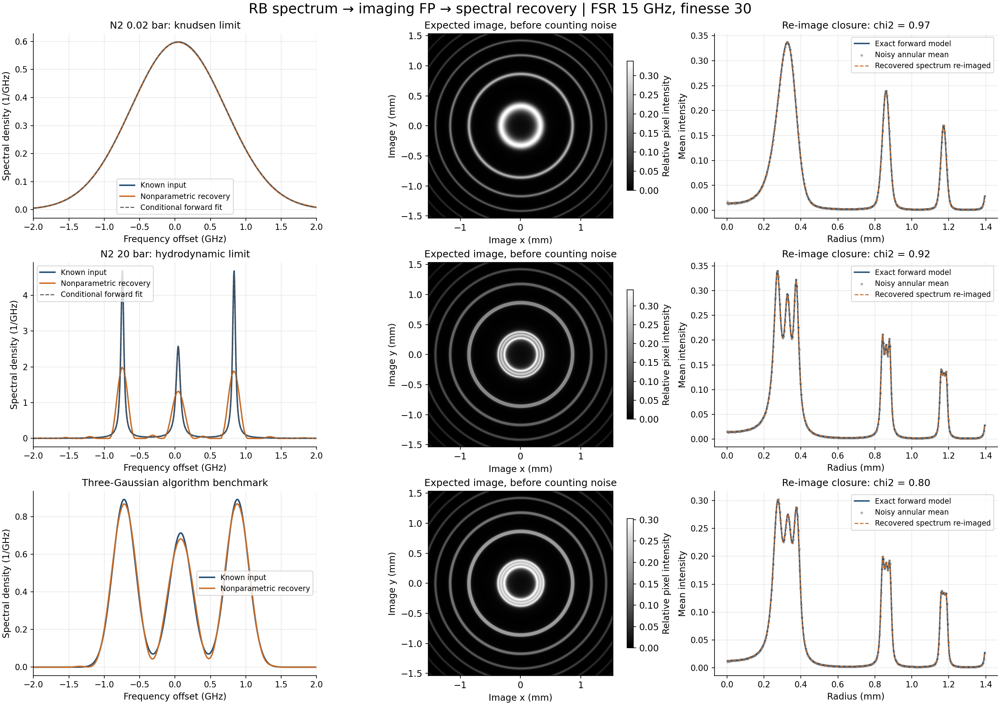
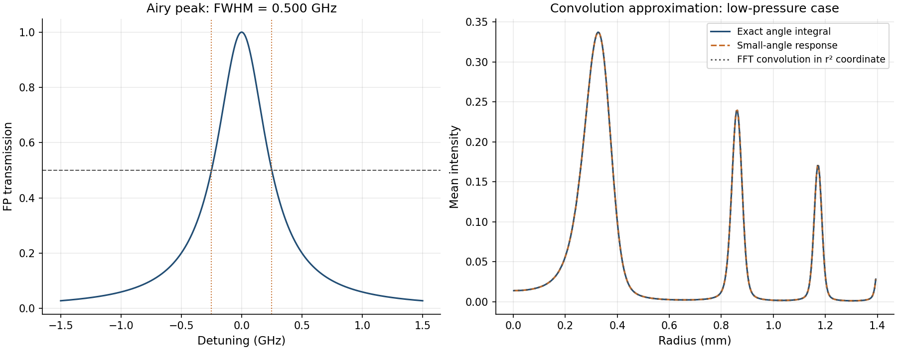
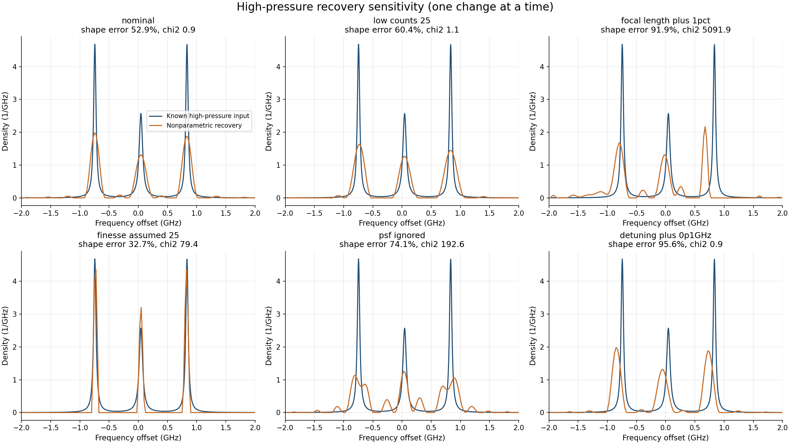
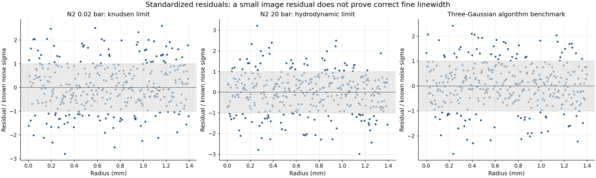
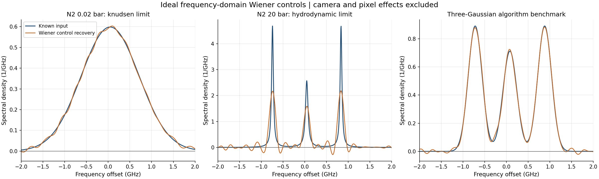

# 瑞利–布里渊散射 / FP 成像：第一版验证结果

这是合成数据的物理与数值验证，尚未使用实验图像。FSR=15 GHz、FP 谱精细度=30；空气腔和配置中的 He–Ne 激光谱为启动假设。

## 当前假设

- 气体摩尔质量28.0134 g/mol（默认氮气）；300 K，90° 散射角；散射波矢方向速度 20 m/s；气体折射率 1。暂不积分接收锥角内的散射角变化。
- 激光 632.8 nm，每个纵模高斯 FWHM=10 MHz；纵模[频移GHz, 权重]=[[0.0, 1.0]]。多纵模参数未知时不能把激光贡献归给气体。
- 成像焦距 100 mm，空气腔；中心失谐 2.5 GHz，照明包络半径 2 mm。
- 相机 768×768，4 um 像素，二维高斯 PSF sigma=4 um；4×4 子像素积分，分析半径 1.4 mm。
- 假设计数尺度2000电子/相对强度单位/像素、背景20电子、读出噪声3电子。未计算绝对散射功率与曝光需求。
- 剪切黏度1.78e-05 Pa s、热导率0.026 W/(m K)、体积黏度0为示例；高压谱宽会依赖这些参数。
- 0.02 bar 用 Knudsen 极限；20 bar 用流体力学极限；三高斯谱仅是算法测试。没有实现 Tenti S6，也不对常压作精确谱形预测。

## 前向模型

输入气体本征谱先与激光谱卷积，然后积分 FP 的频率/角度响应。二维相机模糊采用带 Bessel I0 因子和半径面积权重的轴对称高斯卷积；随后积分像素面积，计算圆环平均强度。环总计数和平均强度明确区分。

- Airy 系数=365.089777；理想反射率=0.900663；光学长度=9.993082 mm。
- 仪器半高全宽=0.500 GHz，不能把精细度30直接作为 Airy 系数。
- 生成、非参数反演、参数拟合分别采用3000、600、2400个频率点；避免只在同一个离散算子上演示恢复。

## 运行结果

| 测试 | y | 非参数谱形相对 L2 误差 | 重新成像 chi² |
|---|---:|---:|---:|
| 低压高斯极限 | 0.019 | 0.25% | 0.975 |
| 高压三洛伦兹极限 | 18.961 | 52.85% | 0.923 |
| 三高斯算法测试 | 不适用 | 3.58% | 0.798 |

非参数方法恢复的是“气体谱与激光谱卷积后的入射谱”。它不假设三峰形状，加入非负约束与二阶平滑，按已知噪声选择正则化强度。chi² 是平均标准化残差平方，接近1表示残差与所设噪声相容；谱形仍可能存在明显误差。

另运行了Wiener反卷积对照：在均匀频率坐标中加入sigma=0.001的独立高斯噪声，再按广义交叉验证（GCV）选择正则化，不使用真实频谱调参。早期仅按chi²≤1选参数，在三峰测试中追逐随机噪声方差而造成严重振铃；固定该失败案例的回归检查后改用GCV。该对照排除了相机、像素和照明影响，不能与带噪环图的恢复误差直接排名；保留负值旁瓣，未裁剪美化。每个控制结果保存为wiener_control CSV，并记录负面积。

## 有谱型先验的前向拟合

- 低压真实频移 44.697 MHz，拟合 44.743 MHz；真实 Gaussian sigma 0.666873 GHz，拟合 0.667235 GHz。
- 在散射角、分子质量、激光谱和仪器函数完全已知的条件下，低压拟合温度 300.325 K（真实300 K）。
- 高压真实 Brillouin 偏移 0.789055 GHz，拟合 0.789139 GHz。
- 高压中心谱线真实 FWHM 69.936 MHz，拟合 70.070 MHz。
- 高压侧峰谱线真实 FWHM 47.146 MHz，拟合 47.529 MHz。

参数拟合假定正确的高斯/三洛伦兹极限谱族及已知谱线权重。其窄线宽估计依赖先验和标定，不能解读为仪器已经具备该宽度的普遍分辨率。Monte Carlo文件记录12次独立噪声拟合；这些散布仅是条件噪声误差，没有覆盖仪器参数或物理模型误差。

## 参数误差敏感性

| 仅改变一个条件 | 高压非参数谱形 L2 误差 | chi² | 达到噪声标准 |
|---|---:|---:|---|
| nominal | 52.85% | 0.92 | 是 |
| low_counts_25 | 60.38% | 1.10 | 否 |
| focal_length_plus_1pct | 91.88% | 5091.86 | 否 |
| finesse_assumed_25 | 32.71% | 79.39 | 否 |
| psf_ignored | 74.13% | 192.59 | 否 |
| detuning_plus_0p1GHz | 95.64% | 0.92 | 是 |

错误焦距、中心失谐、精细度或相机 PSF 会被反演解释成谱形变化。低残差不能单独证明气体线宽正确；应使用窄线参考光标定完整仪器响应。尤其是失谐与整体谱移近似退化：中心失谐误设+100 MHz，恢复谱整体约移-100 MHz，仍能得到良好图样残差。

## 数值一致性

- 小角度卷积近似相对准确角度模型的径向曲线 L2 误差：0.0771%。
- FFT 周期卷积相对小角度直接积分的误差：0.0003%。
- 高压频率积分从3000点改用4500点，图样变化：3.423e-07%。
- 径向网格从1 um加密到0.5 um，子像素4×4加密到6×6，图样变化：0.01759%。

## 图和数据

metrics.json 包含完整参数、恢复指标、正则化路径和条件拟合误差；CSV保存谱和径向曲线，NPY保存期望图像和带噪电子计数图。基准反演使用这张带噪图的圆环均值作为输入。parameters.json 可以作为下次运行的输入。

## 对真实实验还需补齐

气体种类、温度和压力，实际散射角及接收角范围，He–Ne纵模和线宽，FP为空气腔还是固体、有效精细度是否已包含相机，成像焦距/像素尺寸/PSF，参考光环与背景，曝光和计数水平。动力学区间可接入独立验证的Tenti S6频谱，而当前成像与反演模块可以复用。

FP谱响应具有级次歧义；本例将恢复范围限制在一个FSR中。低压和高压案例的亮度都归一化到相同假设计数水平，不能比较真实散射强弱。

来源：SPIE 89101E，doi:10.1117/12.2034394；Witschas et al., Applied Optics 49, 4217 (2010), https://elib.dlr.de/64895/1/204030.pdf。